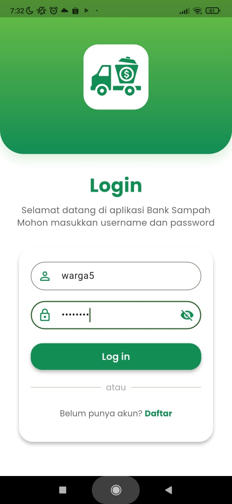
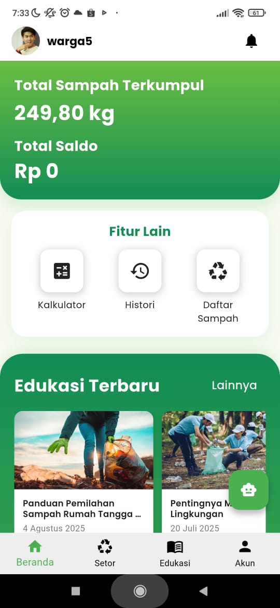
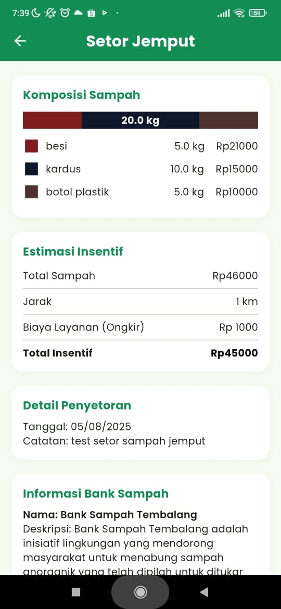

# Bank Sampah Digital - Mobile & Admin Web Application

## Tentang Aplikasi
Bank Sampah Digital adalah aplikasi terintegrasi yang memudahkan pengelolaan sampah berbasis komunitas. Aplikasi ini menghubungkan warga, petugas bank sampah, dan administrator dalam satu platform digital untuk meningkatkan efisiensi pengelolaan sampah dan mendorong gaya hidup berkelanjutan.

- 🌐 Website Admin: https://banksampah.cloud/
- 📱 Download Aplikasi: https://drive.google.com/drive/folders/1EGf2lB8_szINtG4TmIjTm5CGILhI7d33
- 🎯 Dokumentasi API: https://banksampah.cloud/docs/api/

## Fitur utama
### 🏠 Role Warga (Aplikasi Mobile)
- Setor Sampah Langsung: Warga datang ke bank sampah terdekat dengan membawa sampah, pencatatan dan total sampah diinput melalui aplikasi
- Setor Jemput: Warga menginput data sampah dari rumah, memanggil petugas bank sampah melalui aplikasi, dan petugas datang ke rumah
- Edukasi Lingkungan: Akses konten edukasi berupa artikel dan video tentang pengelolaan sampah
- Penarikan Saldo: Tarik saldo dari hasil setor sampah yang telah dikonversi menjadi uang
- Riwayat Transaksi: Melacak semua transaksi setor sampah dan penarikan saldo
- Lokasi Bank Sampah: Menemukan bank sampah terdekat dengan panduan navigasi

### 👤 Role Petugas (Aplikasi Mobile)
- Proses Setoran: Memproses setor sampah dari warga (baik langsung maupun jemput)
- Akses Edukasi: Mengakses konten edukasi artikel atau video untuk meningkatkan pengetahuan

### ⚙️ Role Admin (Website Admin)
- Manajemen User: Mengelola data admin, petugas, dan warga
- Manajemen Konten: Mengelola konten edukasi (artikel dan video)
- Monitoring Transaksi: Memantau semua pencatatan sampah dan transaksi keuangan
- Laporan & Analitik: Generate laporan keuangan dan statistik pengelolaan sampah

## 🛠️ Teknologi yang Digunakan
- Laravel - Framework PHP untuk backend dan website admin
- RESTful API - Arsitektur API untuk komunikasi client-server
- MySQL - Database management system
- Laravel Sanctum - API token management
- Flutter - Framework cross-platform mobile development
- Google Maps API - Integrasi peta dan lokasi
- Camera & Gallery - Fitur pengambilan foto sampah

## 📸 Dokumentasi Aplikasi

### Tampilan Login Aplikasi

### Tampilan Home Aplikasi

### Tampilan Setor Sampah

### Tampilan Konfirmasi
